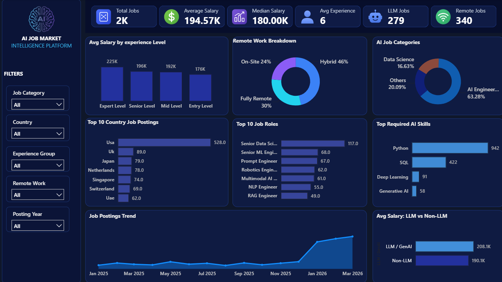

# AI_Job_Market_Intelligece_Platform

🤖 **AI Job Market Intelligence Platform**

Welcome to a project where labor market dynamics meet advanced analytics. This repository is an end-to-end analytics solution designed to analyze global hiring trends, compensation structures, required skill sets, and remote work adoption — answering important industry questions:

* 💭 Which AI job roles and skill sets are currently in highest demand?
* 💭 How do experience levels and specialization (e.g., LLMs/GenAI) impact average salary?
* 💭 What are the global hubs for AI hiring and how is remote work distributed?

🧠 **Project in a Nutshell**

This project brings together Python, SQL, and Power BI to transform raw AI market data into actionable market intelligence.
Using data preprocessing, exploratory data analysis, DAX modeling, and interactive dashboards, the project uncovers patterns in global hiring, compensation benchmarks, emerging skill requirements, and remote work distribution.

🎯 **Final Outcome:** A complete market analytics solution featuring key performance indicators (KPIs), multi-dimensional charts, strategic insights, and an interactive Power BI dashboard.

🧩 **Key Components**

| Module | Description |
| :--- | :--- |
| 🛠 **Python** | Clean, standardize, and preprocess raw job posting and skill data |
| 📊 **EDA in Python** | Explore salary distributions, skill co-occurrences, and market trends |
| 🧾 **SQL Analysis** | Perform analytical queries to aggregate roles, salaries, and regional data |
| 📈 **Data Visualization** | Generate exploratory distribution plots and trend charts using Matplotlib and Seaborn |
| 📊 **Power BI Dashboard** | Build an interactive dashboard featuring executive KPIs, slicers, and cross-filtering |

📊 **Sneak Peek into Business Insights**

* ✔ Analyzed **2K+ job postings** with an average salary of **$194.57K** and median salary of **$180.00K**
* ✔ Evaluated salary progression across experience tiers: **Expert ($225K)**, **Senior ($196K)**, **Mid ($192K)**, and **Entry ($176K)**
* ✔ Analyzed remote work policy distribution: **Hybrid (46%)**, **Fully Remote (30%)**, and **On-Site (24%)**
* ✔ Mapped category demand dominated by **AI Engineering (63.28%)** and **Data Science (16.63%)**
* ✔ Quantified high-demand AI skills, led by **Python (942 postings)** and **SQL (422 postings)**, followed by **Deep Learning** and **Generative AI**
* ✔ Identified a premium on specialized roles, where **LLM / GenAI positions average $208.1K** compared to **$190.1K for Non-LLM roles**

## 📊 Dashboard Preview

🚀 **What Makes This Project Unique?**

* ✅ **End-to-end workflow:** From raw job postings CSV to interactive Power BI dashboard
* ✅ **Multi-tool analytics:** Python, SQL, and Power BI combined into a unified workflow
* ✅ **Market-focused analysis:** Targets high-growth tech domains like Generative AI, RAG, Prompt Engineering, and Multimodal AI[cite: 2]
* ✅ **Interactive storytelling:** Transforms complex global hiring data into clear, actionable executive insights

👨‍💻 **Built By**

**Nilesh Pardhi**
* 🎓 B.Tech — Artificial Intelligence & Machine Learning
* 🧠 Python • SQL • MySQL • Power BI • Data Analysis • Data Visualization
* 🔗 LinkedIn : [https://www.linkedin.com/in/nilesh-pardhi/](https://www.linkedin.com/in/nilesh-pardhi/)

📌 **Ideal For**

* 📥 Recruiters evaluating data analysis, market intelligence, and dashboard building skills
* 🎓 Students exploring AI industry hiring benchmarks and skill demands
* 📊 Beginners building Python, SQL, and Power BI portfolio projects
* 💼 Talent strategists and HR analysts tracking competitive compensation and tech trends

🏁 **Final Thoughts**

This project demonstrates how raw job market data can be transformed into clean datasets, robust analytical models, interactive visualizations, and actionable compensation strategies.

It represents a practical approach to solving real-world market intelligence challenges using Python, SQL, and Power BI.

🚀 *Turning raw data into business insights, one analysis at a time.*
